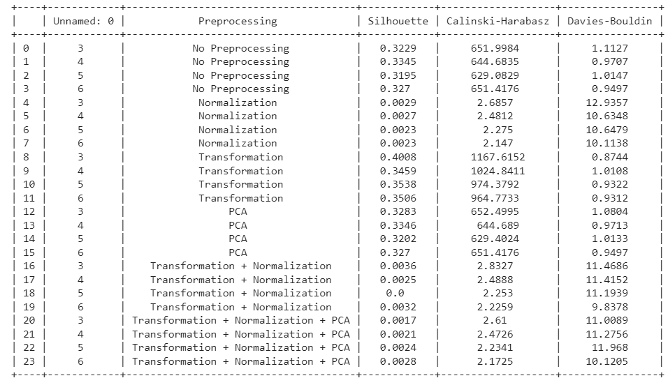
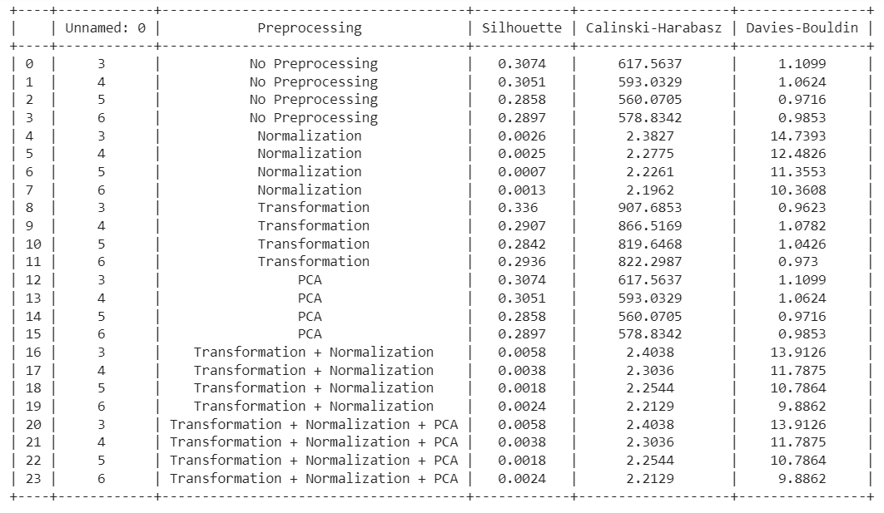

# Clustering_Raghav_102103042

Submitted by: ***Raghav Dargan*** 

Roll No: ***102103042***

Group: ***3COE2***

## Clustering Assignment using PyCaret

### Description
The dataset utilised for this clustering task is centred on Pokemon and comprises data pertaining to a wide range of Pokemon species.

### Dataset
The dataset utilised in this clustering task is centred on Pokemon and comprises data pertaining to a wide range of Pokemon species https://www.kaggle.com/datasets/abcsds/pokemon

### Clustering Techniques
1. **K Means Clustering**
2. **Hierarchical Clustering**
3. **Birch clustring**

### Evaluation Parameters
The clustering techniques are evaluated based on the following parameters:

1. **Silhouette Score**
2. **Calinski-Harabasz Index**
3. **Davies-Bouldin Index**

### Graphs showing Pre-Processing Techniques
Various pre-processing techniques are applied to the data before clustering:

1. **Normalization:** Scaling the features to a standard range.
   
2. **PCA (Principle Component Analysis):** Reducing dimensionality using PCA.
   
3. **Transform:** Applying a transformation to the data.
     
4. **Normalization + Transformation:** Combining normalization and transformation techniques.
       
5. **Normalization + Transformation + PCA:** Combining normalization, transformation, and PCA techniques.
       
   
### Results Table

1. Kmeans Clustering
   
   </img>

2. Hierarchical clustering
  
   </img>

3. Birch clustering

    </img>

 ### Conclusion

This assignment investigates the utilisation of clustering algorithms in conjunction with diverse pre-processing techniques on the Pokemon dataset. The outcomes and visual representations offer valuable insights regarding the efficacy of various clustering techniques across diverse scenarios.

Feel free to reach out for any questions or further discussions!
